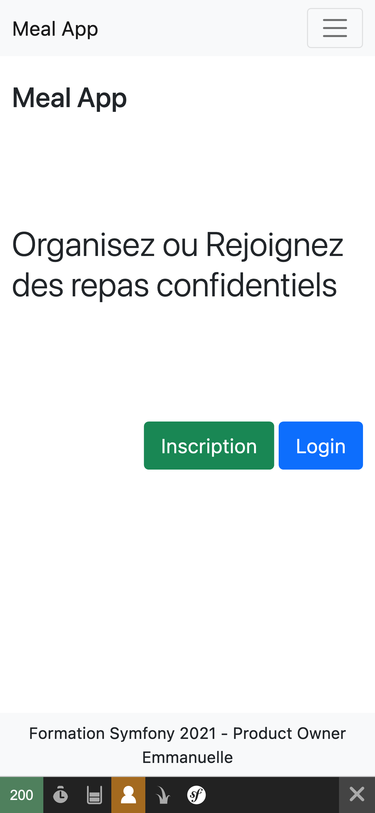
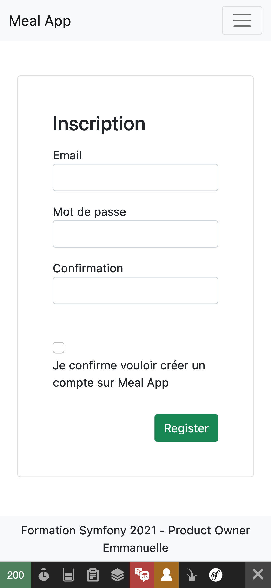
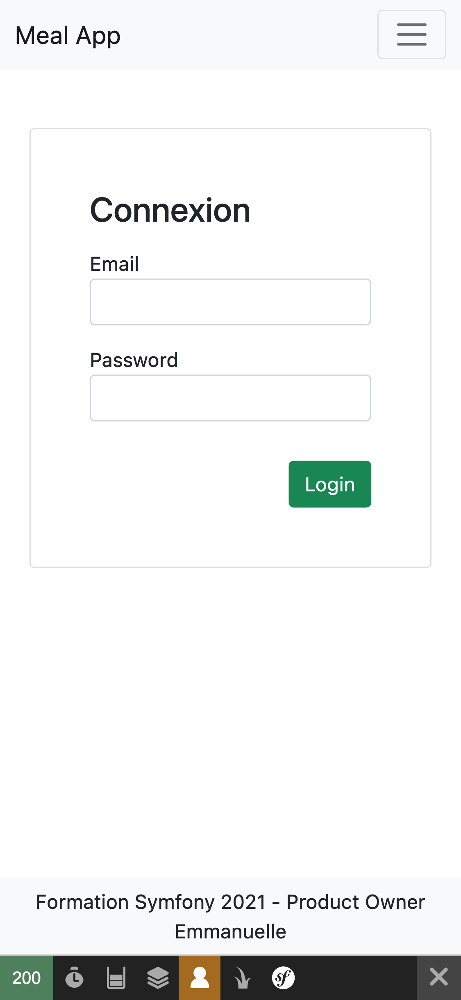
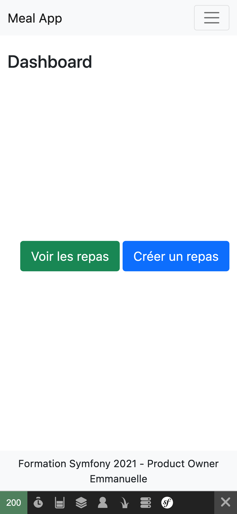
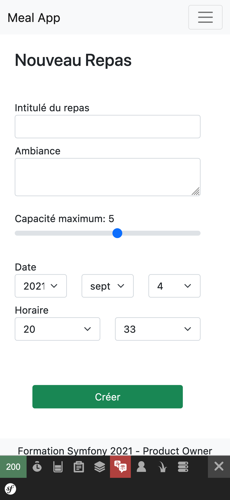

# 🎓  TP - Symfony

**Vous allez être évalués sur votre capacité à atteindre les objectifs fonctionnels 📝 suivants.**

Vous avez étudié les notions suivantes: `Routing`, `Controllers`, `Twig`, `Formulaires`, `Validation`, `Doctrine`, `Authentification` dans une conception de produit que vous avez déterminé.

### **Précédement**

Nous avons determiné des wireframes, un diagramme de classe des entities et avont atteints des objectifs en validant des notions de cours.

### **Maintenant**

Vous allez implémenter et utiliser le diagramme d'entité pour atteindre de nouveaux objectifs fonctionnels.

___

## 👨🏻‍💻 Refactor

* 📝 **Refactorez** le code.

Cette étape vous permet de vous remettre dans le projet.

___

## 👨🏻‍💻 Meal

* 📝 **Modifiez l'entity "Meal"** en ajoutant les attributs relationnels.
* 📝 **Créez les "Category"** possédant les "name" suivants: Classique, Végétarien, Végétalien, Vegan.

Pour remplir la table "meal" des informations précédentes vous avez plusieurs solutions.
* Insertion manuelle dans la table pour gagner du temps
* Insertion avec les DataFixtures pour découvrir le composant.

@see [datafixtures](https://symfony.com/bundles/DoctrineFixturesBundle/current/index.html): https://symfony.com/bundles/DoctrineFixturesBundle/current/index.html

* 📝 **Modifiez le type "Meal"** en ajoutant le champ "category". Le formulaire à l'affichage doit proposer des checkbox permettant de choisir des catégories.

Afin d'intégrer l'attribut relationnel, orientez vous vers "EntityType". Vous risquez d'avoir un problème de conversion en string, je vous invite à trouver une solution, éventuellement en reprennant le chapitre du support de cours concernant les formulaires.

@see [entitytype](https://symfony.com/doc/current/reference/forms/types/entity.html)

* 📝 **Sauvegardez le "Meal"** en affectant l'utilisateur connecté à l'attribut "createdBy"

___

## 👨🏻‍💻 Profile

* 📝 **Modifiez l'entity "Profile"** en ajoutant les attributs relationnels et en rendant l'attribut avatar optionnel.

* 📝 **Créez les "Gender"** possédant les "name" suivants: Femme, Homme, Autre.

* 📝 **Modifiez le type "Profile"** en ajoutant le champ "gender". Le formulaire à l'affichage doit proposer des boutons radio permettant de choisir un genre.

* 📝 **Sauvegardez le "Profile"** en permettant à l'utilisateur de pouvoir modifier son avatar...

Attention à la logique de sauvegarde: l'utilisateur connecté ne possède pas forcement de profil. La première fois qu'il modifie son profil il faut créer un nouveau profil qu'il faut persister. Par contre si l'utilisateur à déjà créé un profil il faut le récupérer afin de le mettre à jour uniquement.

@see [update](https://github.com/seeren-training/Symfony/wiki/07#-update)

___

## 👨🏻‍💻 Category

* 📝 **Affichez les catégories** sur la page qui liste les repas.

* 📝 **Filtrez par catégorie** les repas.

* 📝 **Filtrez par date** les repas.

___

## 🕕 Gérez votre temps

L'objectif ce n'est pas de terminer l'ensemble des fonctionnalité et d'avancer quand une thématique est maîtrisée.